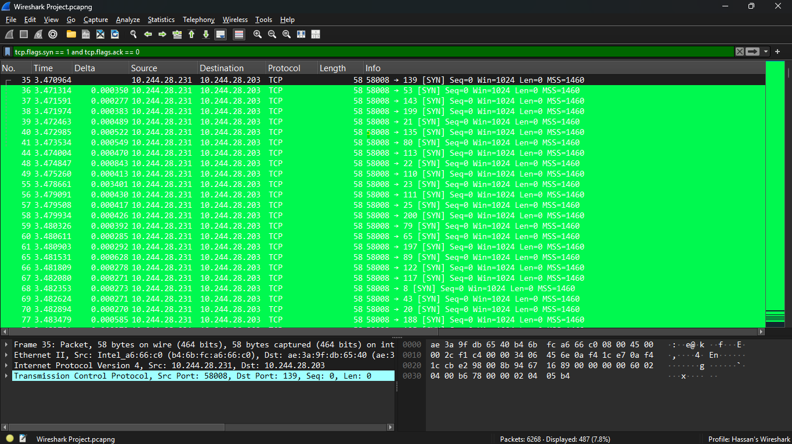
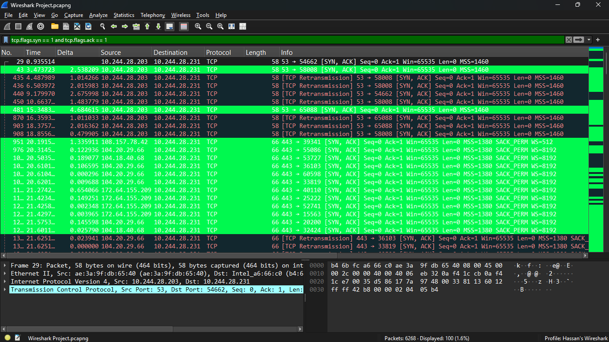
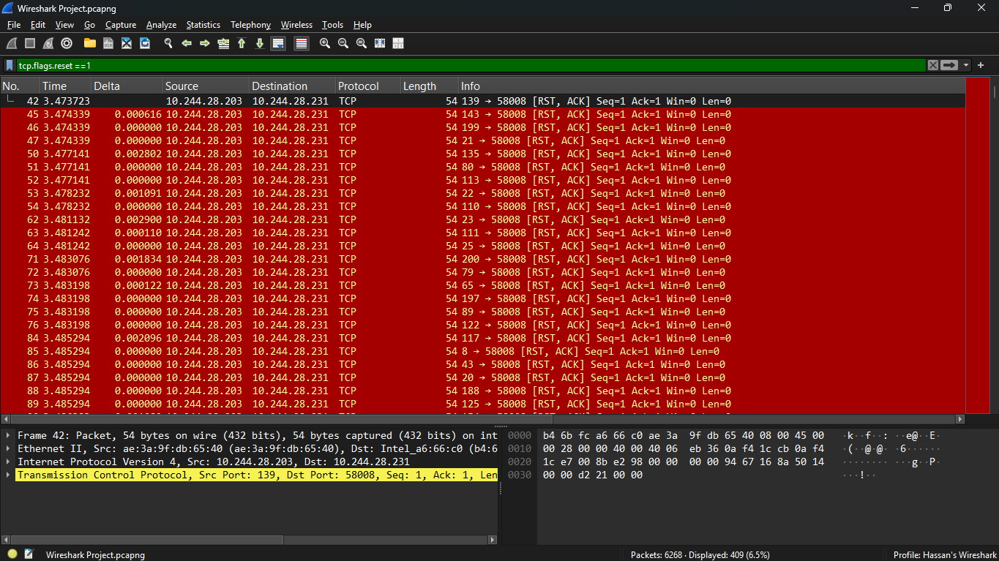
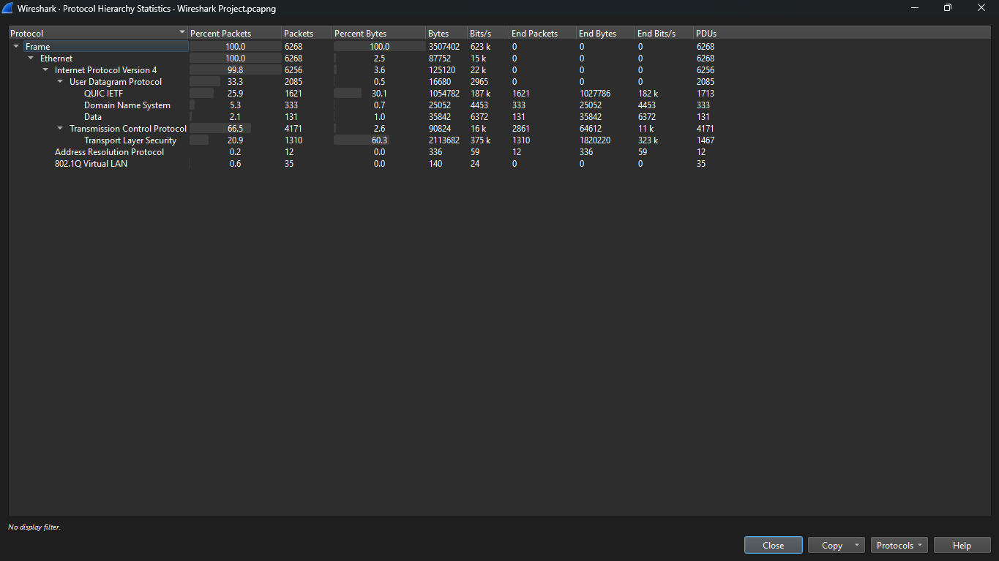

# Wireshark Network Traffic Analysis Project

## Project Overview

This project demonstrates practical network traffic analysis using Wireshark and Nmap in a controlled lab environment.

The objective was to:

- Capture live network traffic
- Generate a controlled TCP SYN scan
- Identify open and closed ports through packet inspection
- Differentiate normal traffic from reconnaissance activity

Through packet-level analysis, a TCP SYN scan was successfully identified and analyzed, including SYN packets, SYN-ACK responses (open port), and RST responses (closed ports).

## Lab Environment
- OS: Windows 11
- Network: Mobile hotspot (DHCP assigned private IP)
- Tools:
  - Wireshark
  - Nmap

## Objectives
- Capture live traffic
- Identify normal HTTPS traffic
- Perform a TCP SYN scan using Nmap
- Detect scan behavior in Wireshark
- Write a basic incident report

## Key Finding: TCP SYN Scan Detected

During analysis, multiple TCP SYN packets were observed from the host to the gateway IP within a very short time interval.

Indicators:
- Same source IP
- Same destination IP
- Multiple destination ports
- SYN flag set, ACK flag not set

This behavior is consistent with a TCP SYN port scan.

## Evidence

### SYN Packets Sent to Multiple Ports

### SYN-ACK Response (Open Port 53)

### RST Responses (Closed Ports)

### Protocol Hierarchy Overview

## Skills Demonstrated
- Packet filtering (tcp.flags.syn == 1 and tcp.flags.ack == 0)
- TCP handshake analysis
- Identifying open vs closed ports
- Understanding SYN, SYN-ACK, and RST responses

## Analysis

### Observed Behavior

During packet inspection, multiple TCP SYN packets were sent from the source host (10.244.28.231) to the gateway (10.244.28.203) targeting multiple destination ports within a very short time interval.

This pattern is consistent with a TCP SYN port scan.

### Port State Determination

The following responses were observed:

- Port 53 returned a SYN-ACK response → This indicates the port is OPEN.
- Multiple other ports returned RST-ACK responses → These ports are CLOSED.

No long TCP session establishment was observed for closed ports, confirming scanning behavior rather than legitimate service communication.

### Why This Is Suspicious

Normal user activity (web browsing) typically:
- Connects to a single destination port (usually 443)
- Communicates with multiple external IP addresses

In contrast, this activity:
- Targeted a single IP address
- Attempted connections to many different ports
- Occurred in rapid succession

This behavior matches known reconnaissance techniques used in the early stages of cyber attacks.

## Key Findings

- Multiple TCP SYN packets were sent to sequential ports within milliseconds.
- Port 53 responded with SYN-ACK, confirming it is OPEN.
- Other scanned ports returned RST-ACK responses, confirming they are CLOSED.
- The scanning behavior matched the characteristics of a TCP SYN reconnaissance scan.
- Background HTTPS traffic (port 443) was identified and separated from scan traffic using precise filtering.

This demonstrates the ability to:
- Interpret TCP handshake behavior
- Identify reconnaissance techniques
- Use display filters effectively
- Distinguish malicious patterns from normal traffic.

## Skills Demonstrated

- Network Traffic Analysis
- TCP/IP Deep Understanding
- Wireshark Filtering & Packet Inspection
- Port State Identification
- Reconnaissance Detection
- Documentation & Reporting

---

This project reflects practical SOC-level packet analysis and demonstrates the ability to investigate and interpret suspicious network behavior.
